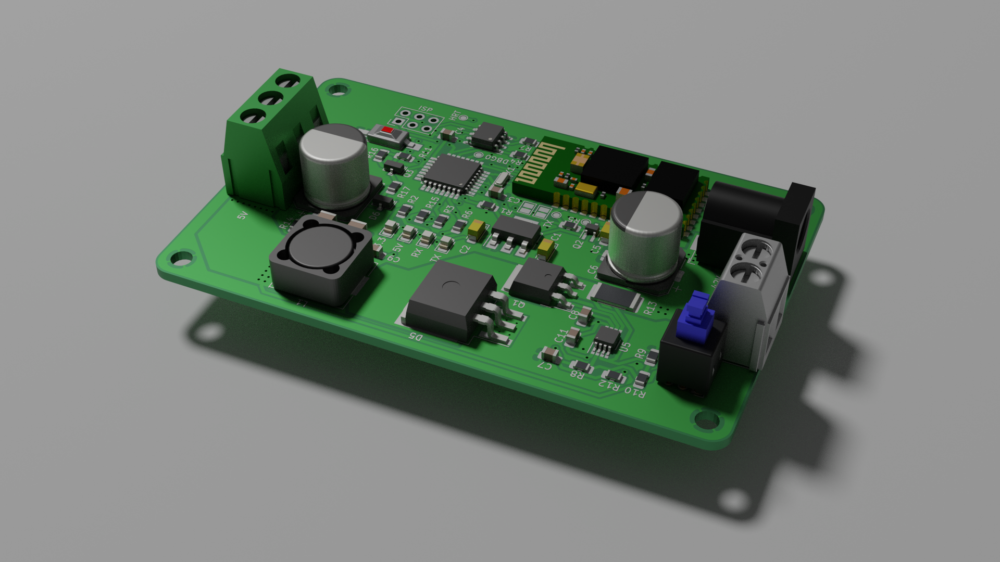

## Blueled - Bluetooth LED strip controller

This repo has hardware and firmware for Bluetooth LED strip controller based on
atmega328p (the same as in Arduino Nano).

Features:

* Android Application (not started yet)
* Custom colors and gradients
* ~15 different pre-set animation
* Over-The-Air Updates
* Python interface (to control it from PC)
* Save latest state between power on/off
* Up to 100 LEDs on full brightness (WS2812B)

#### Notes (to refactor)

Be careful with connection between programmer Arduino and target Arduino. I had
a lot of corrupted bytes during uploading bootloader/application with ISCP.

Add bluetooth:

    $ sudo systemctl start bluetooth
    $ sudo bluetoothctl
    $ power on
    $ scan on
    $ # You will see MAC of your HC-05
    $ trust <MAC>
    $ pair <MAC>
    $ # It will ask for pin
    $ # That's all!

Load rfcomm kernel module:

    sudo modprobe rfcomm 

Create serial port:

    sudo rfcomm bind rfcomm0 <MAC>

How to sniff bluetooth:
https://github.com/snarlistic/jpnevulator

    jpnevulator --tty=/dev/blueled --read --ascii

In case of problems with PC's bluetooth module try:

1. power on/off module through the bluetoothctl session
2. sudo rfkill unblock all

https://gist.github.com/0/c73e2557d875446b9603
